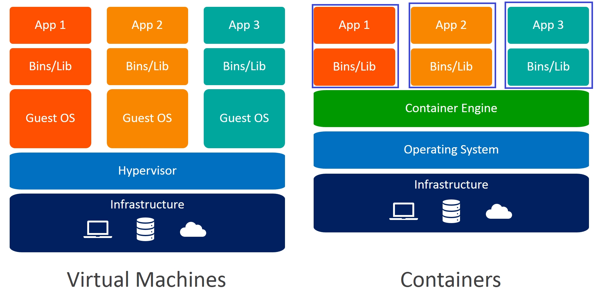

# Tutorial de Instalação do SGBD Postgres em um Container Docker

## Guia completo sobre o processo de instalação do sistema de gerenciamento de banco de dados relacional Postgres e da interface pgAdmin em um ambiente utilizando a ferramenta de containerização Docker.

<br>

[](./README.md)

<div align="center">
    
</div>
<br>

O Postgres é um Sistema de Gerenciamento de Banco de Dados (SGBD) objeto-relacional e tem suas origens no projeto POSTGRES, criado na Universidade da Califórnia em Berkeley, na década de 80. Com décadas de desenvolvimento contínuo, o Postgres se consolidou como o banco de dados de código aberto mais avançado disponível atualmente. Considerado entre os quatro SGBDs mais utilizados do mercado, dados do [DB-ENGINES](https://db-engines.com/en/ranking) demonstram o quão popular o Postgres se tornou.

Nesse tutorial, você aprenderá a realizar a instalação de uma instância Postgres em um ambiente utilizando a tecnologia Docker e aprendendo seus conceitos envolvidos, tais como: imagem, container, volume, rede e um pouco sobre DockerHub. Adicionalmente, a instalação da ferramenta gráfica de gerenciamento do Postgres, o pgAdmin, também será abordada. Caso se sinta confortável, você pode pular alguns tópicos e acessar diretamente as seções de [Instalação do Postgres](#instalação-do-postgres) e [Instalação do pgAdmin](#instalação-do-pgadmin).

## Visão Geral da Plataforma Docker

O [Docker](https://www.docker.com/) é uma plataforma de software projetada para facilitar a criação, teste, distribuição e implantação de aplicativos de forma ágil. Ele organiza o software em uma estrutura denominada container, que é a unidade padronizada que contém todos os elementos necessários para sua execução, tais como: bibliotecas, ferramentas do sistema, código e ambiente de execução. Com o Docker é possível (de forma rápida e fácil) distribuir e implementar softwares em qualquer ambiente, escalando suas aplicações conforme a demanda e garantindo seu bom funcionamento.

### O que é uma Imagem Docker?

Uma imagem Docker é um pacote leve que contém tudo que é necessário para execução de um software. O pacote da imagem é um conjunto de arquivos empacotados, organizados em camadas, que representam o sistema de arquivos necessário para executar um aplicativo. 

Para que se possa executar uma aplicação, sob o contexto Docker, é necessário utilizar uma imagem para a construção da instância na qual essa aplicação será executada; a essa instância denomina-se o termo 'container'. Então, por lógica, todo container Docker possui uma imagem base que o gerou.

As imagens Docker podem ser escritas em um arquivo chamado `Dockerfile`. A imagem pode ser construída totalmente do zero ou utilizar outras imagens Docker como base para construção de sua própria imagem. De modo geral, as principais características de uma imagem são:

- **Sistema de Arquivos Base**: e.g. podendo ser uma distribuição Linux, como: Ubuntu, Alpine ou CentOS;
- **Dependências do Aplicativo**: bibliotecas, pacotes e outras dependências que o software exigir;
- **Código**: código fonte do aplicativo que será executado;
- **Configurações**: i.e. variáveis de ambiente e/ou comandos iniciais para instruções de execução.

Para facilitar o compartilhamento e a reutilização das imagens, elas podem ser armazenadas em repositórios remotos. Em especial, o [DockerHub](https://hub.docker.com/) é o repositório oficial Docker, mantido pela Docker, no qual você pode gerenciar, subir e baixar suas próprias imagens, além de acessar outras imagens públicas. A plataforma é gratuita e você poderá criar uma conta sem nenhum custo adicional.   

### O que é um Container Docker?

Um container Docker é uma unidade leve e isolada de software que agrupa um aplicativo e todas as suas dependências necessárias (como bibliotecas, arquivos de configuração e binários) para que ele possa ser executado de forma consistente em qualquer ambiente. A partir de uma imagem Docker é possível construir o container da aplicação desejada.

As principais características de um container são:

- **Isolamento**: o sistema de arquivos, processos, redes, dependências e configurações do container são específicas para a aplicação. Essa infraestrutura é isolada do sistema operacional host que o mantém e de outros containers;  
- **Portabilidade**: um container pode ser executado em qualquer host, independentemente de seu sistema operacional subjacente. Isso é possível desde que o host possua compatibilidade com a plataforma Docker;
- **Eficiência**: o container, diferentemente das máquinas virtuais, não apresentam sistema operacional em sua estrutura interna. Sua operação se dá devido ao compartilhamento do mesmo kernel com o sistema operacional host, o que o torna o procedimento mais leve e rápido;
- **Ciclo de Vida**: um container pode ser criado, iniciado, parado, reiniciado e removido. Ele é considerado uma "instância em execução" da imagem Docker;
- **Imutabilidade**:  qualquer alteração feita internamente ao container (e.g. executar um comando de instalação de uma dependência específica) será perdida quando o container for reinicializado – a menos que seja salva em um volume de dados ou redefinido em sua imagem Docker. Por esse motivo, containers são tidos como efêmeros e imutáveis.  

### O que é um Volume Docker?

Um volume Docker é um mecanismo para armazenar e compartilhar dados entre containers e entre containers e o host. Em uma situação em que o container é removido ou reinicializado, ele perde todas as suas informações. Uma forma de contornar o problema da perda dessas informações é fazendo uso de volumes Docker, que garantem a preservação dos dados a partir da persistência no ambiente host.

Na prática, o nosso objetivo é criar cópias dos dados que estão no container para o host que contém o Docker. Se houver, por parte do container, indisponibilidade de acessá-lo ou inexistência (devido à uma remoção), ainda será possível acessar esses dados, criando uma independência dos dados para com o estado do container.

Em resumo, criar volumes é criar repositórios de dados dos containers localmente, a partir do gerenciamento do Docker. As principais características de um volume Docker são:

- **Persistência**: os dados em um volume não são excluídos quando o container é removido;
- **Compartilhamento**: facilita a troca de arquivos entre containers;
- **Desempenho**: volumes gerenciados pelo repositório de volumes do Docker são mais rápidos e eficientes do que [bind mounts](https://docs.docker.com/engine/storage/bind-mounts/) (montagens diretas de pastas do sistema de arquivos do host);
- **Portabilidade**: volumes são gerenciados pelo Docker, tornando mais fácil transportar dados entre ambientes.

### O que é uma Rede Docker?

Uma rede Docker é um componente que possibilita a comunicação entre containers e entre containers e o host. No Docker, como cada container é uma instância independente e isolada, não é possível que eles consigam se comunicar sem estarem submetidos a uma configuração de rede comum. 

As redes Docker são gerenciadas pelo próprio Docker, de modo a proporcionar flexibilidade e segurança para as aplicações, garantindo uma comunicação segura, eficiente e controlada.

As principais características de uma rede Docker são:

- **Isolamento**: as redes Docker permitem isolar os containers dentro de suas configurações de rede, garantindo que apenas os containers pertencentes à mesma rede possam se comunicar entre si;
- **Conectividade Facilitada**: containers conectados à mesma rede podem se comunicar diretamente pelo nome do container;
- **Suporte**: as redes Docker ofertam múltiplos drivers de suporte, com  diferentes tipos de redes, para atender diversas necessidades.

### O Repositório DockerHub

O DockerHub é uma plataforma em nuvem centralizada utilizada como repositório remoto para imagens Docker (semelhente ao que o GitHub é para o armazenamento de códigos fonte). Popular e amplamente utilizado para buscar, armazenar e distribuir imagens Docker desenvolvidas por indivíduos, equipes ou organizações.

> Para mais informações, acesse [DockerHub](https://hub.docker.com/).

> Em linhas gerais, para informações relativas a documentação do Docker, você pode estar acessando [Docker Docs](https://docs.docker.com/build-cloud/).

## Porque Instalar o Postgres Usando o Docker?

Para que possamos responder a essa pergunta, é importante comparar dois cenários: a instalação do Postgres diretamente no ambiente host e a instalação em um container Docker. Já adiantando, você entenderá que, por exemplo, o uso do Docker oferece diversas facilidades como o de instalação e remoção do próprio SGBD.

Antes de responder a essa pergunta, vamos primeiramente analisar o problema da instalação direta no ambiente host e suas implicações:

#### Quais eventuais problemas poderiam surgir devido ao uso do Postgres instalado diretamente em um ambiente host?

- **Risco de Conflitos**: atualizar ou alternar entre versões do Postgres pode não ser uma tarefa fácil. O gerenciamento de versões de um mesmo SGBD em um mesmo ambiente pode causar conflitos, tanto nas configurações quanto na instalação de dependências;

- **Desinstalação**: arquivos de configuração e dependências para execução do SGBD Postgres são instalada no sistema de arquivos do ambiente host. Caso você não conheça os locais de instalação e configuração do Postgres no ambiente e, caso exista mais de uma versão do SGBD, a desinstalação exigirá trabalho e um conhecimento prévio desse ambiente;

- **Portabilidade**: toda configuração realizada em um ambiente host não será portável, caso você mude de máquina. Basicamente, todo o processo de configuração deverá ser refeito em um novo ambiente host;

No contexto em que o SGBD Postgres é instalado via Docker, essas problemáticas deixam de existir, pois o SGBD é instânciado dentro de um container – que possui seu próprio sistema de arquivos – juntamente com suas dependências. Dessa forma, toda a configuração do SGBD fica isolada do ambiente host. A figura abaixo mostra a diferença arquitetural no funcionamento de uma máquina virtual em comparação com um container Docker:

<div align="center">
    
</div>
<br>

#### O que torna o uso de uma instância Postgres em um container Docker vantajoso?

- **Isolamento**: o Postgres rodando em um container é isolado do sistema operacional do host; sua configuração é definida no sistema de arquivos do container (independente do sistema de arquivos do ambiente host); não há conflitos de versões ou alterações indesejadas no sistema host, pois o SGBD fica definido no sistema de arquivos do container (separado do host); é possível rodar várias instâncias Postgres com diferentes versões ou configurações em paralelo – cada uma definida em um container separadamente;

- **Configuração**: o ato de instalação do Postgres é simples e direto e, com um único comando, é possível configurar a instância e instalar as bibliotecas necessárias do SGBD sem qualquer intervenção manual; em contrapartida, o ato de remoção do container também se apresenta de forma simples, permitindo excluir totalmente a instância Postgres e suas dependências sem deixar resíduos no sistema;      

- **Teste de Compatibilidade**: devido a capacidade de se rodar facilmente diferentes versões de instâncias Postgres, isso lhe permite testar a compatibilidade com uma aplicação em específico;

- **Portabilidade**: independente de qual ambiente o container esteja, o mesmo container (mesma estrutura) será executado, desde que o sistema contenha o Docker instalado e faça o uso de uma imagem Docker de mesma versão. Isso garante a consistência entre ambientes de desenvolvimento, teste e produção;

- **Reprodutibilidade**: com a garantia da consistência entre os ambientes que fazem uso Docker, é possível reproduzir as mesmas condições de atividades para qualquer usuário do Postgres em um container; se funciona em um ambiente host, funcionará em um outro ambiente distinto; isso elimina o ditado: "na minha máquina funciona!".

## Instalação do Postgres

Para realizarmos a instalação da instância Postgres como um container Docker é necessário atender alguns pré-requisitos. Nessa seção será abordado os pré-requisitos necessários e elencado o passo a passo para baixar a imagem Docker e criar a instância Postgres propriamente (container). Caso você tenha dificuldades em alguns conceitos a respeito do Docker, sugiro você acessar a seção [Visão Geral da Plataforma Docker](#visão-geral-da-plataforma-docker).

> **OBS:. Os comandos Docker listados em toda essa seção de Instalação do Postgres funcionam da mesma forma no Linux, Windows e macOS, desde que o Docker Desktop esteja instalado no Windows e no macOS. No Linux, o Docker é executado de forma nativa, enquanto no Windows se recomenda a ativação do WSL 2 para melhor compatibilidade. Com o ambiente configurado, os comandos podem ser usados no terminal (Linux/macOS) ou no PowerShell (Windows) sem nenhuma diferença.**

### Pré-Requisitos (Postgres)

O único pré-requisito necessário para instalação da instância Postgres, como um container Docker, em um ambiente é o próprio Docker instalado. Para verificar se você possui o Docker instalado em sua máquina, use o comando:

```
docker info
```

ou, mais resumidamente, 

```
docker --version
```

Caso não possua o Docker instalado em sua máquina, verifique o sistema operacional de seu servidor e realize o procedimento de instalação. Para informações de instalação do Docker, acesse a página da documentação [Install Docker Engine](https://docs.docker.com/engine/install/) ou navegue pelas badges indicativas abaixo:

[](https://docs.docker.com/desktop/setup/install/windows-install/)
[](https://docs.docker.com/desktop/setup/install/linux/)
[](https://docs.docker.com/desktop/setup/install/mac-install/)

### Baixando a Imagem Oficial do Postgres

A [Imagem Oficial do Postgres](https://hub.docker.com/_/postgres) está hospedada no DockerHub. Ela é pública e acessível. Nesse caso, iremos baixar a versão mais recente (tag: `latest`). Para baixá-la em seu servidor, use o comando:

```
docker pull postgres
```

ou, caso queira baixar alguma versão específica do Postgres, use:

```
docker pull postgres:[version]
```

em que `version` representa a versão Postgres desejada.

> Versões específicas do Postgres podem ser encontradas em [Postgres Tags](https://hub.docker.com/_/postgres/tags).

Após execução do comando, você pode estar verificando sua imagem Docker Postgres no repositório de imagens gerenciado pelo Docker, usando:

```
docker images
```

### Criação da Instância Postgres

Você pode criar sua instância Postgres de duas maneiras diferentes: a partir de uma configuração padrão (simplificada) ou personalizada. De modo mais simples, podemos criar a instância do Postgres com o seguinte comando:

```
docker run --name [pg_ctn_name] -e POSTGRES_PASSWORD=[pg_secret_password] -d postgres:[version]
```

ou, de modo mais personalizado, embora com maiores detalhes, você pode seguir a forma explicitada no comando:

```
docker run --name [pg_ctn_name] \
    -p [host_port]:[ctn_port] \
    -e POSTGRES_PASSWORD=[pg_secret_password] \
    -e POSTGRES_USER=[pg_user_name] \
    -e POSTGRES_DB=[pg_db_name] \        
    -e POSTGRES_INITDB_ARGS=[pg_initdb_args] \
    -e POSTGRES_INITDB_WALDIR=[pg_initdb_waldir] \
    -e POSTGRES_HOST_AUTH_METHOD=[pg_host_auth_method] \
    -e PGDATA=[data_directory_path] \
    -v [host_data_directory_path]:[data_directory_path] \
    -d postgres:[version]
```

em que `pg_ctn_name` representará o nome do container Docker relativo a instância Postgres; `host_port` e `ctn_port` representarão – respectivamente – a porta, no sistema host, usada para acessar o serviço e a porta, no container, em que o serviço estará sendo executado; `pg_secret_password` representará a senha do superusuário Postgres; `pg_user_name` representará o nome do superusuário Postgres; `pg_db_name` representará o nome do banco de dados inicial do Postgres; `pg_initdb_args` representa a sequência de argumentos adicionais, a serem passados para o comando **initdb**, que serão utilizados durante a inicialização do banco de dados; `pg_initdb_waldir` representará o diretório local de armazenamento de logs de transações do Postgres; `pg_host_auth_method` representará o método de autenticação de acesso ao banco de dados (via host); `data_directory_path` representará o caminho onde os dados do Postgres serão armazenados; `host_data_directory_path` representará o caminho do diretório, no sistema host, que será montado no container – em referência ao volume de dados da instância Postgres; e `version` representa a versão Postgres utilizada pela imagem Docker.

> **OBS:. Ao criar uma instância Postgres, um superusuário e um banco de dados padrão denominado 'postgres' são criados automaticamente, a menos que sejam especificados valores diferentes por meio de variáveis de ambiente.**

> **OBS:. As variáveis de ambiente ​​especificadas só terão efeito se você iniciar o container com um diretório de dados vazio; qualquer banco de dados pré-existente permanecerá intocado na inicialização do container.**

Para fim de exemplo, você pode estar testando o comando `docker run` explicitado abaixo: 

> **OBS:. Considere utilizar a versão de imagem Docker mais recente (tag: `latest`):**

```
docker run --name postgres-dbms \
    -p 5432:5432 \
    -e POSTGRES_PASSWORD=postgresAdmin \
    -e POSTGRES_USER=postgresAdmin \
    -e PGDATA=/var/lib/postgresql/data \
    -v pg_data_volume:/var/lib/postgresql/data \
    -d postgres:latest
```

Após executar o comando, você pode estar verificando sua instância Postgres no repositório de containers gerenciado pelo Docker:

```
docker ps
```

Para mais detalhes de execução de containers, você pode estar acessando a documentação [Running Containers](https://docs.docker.com/engine/containers/run/).

Em caso de dúvidas, com relação as flags de execução Docker, consulte a seção de [Orientações Gerais](#orientações-gerais) logo abaixo. Na seção [Variáveis de Ambiente](#variáveis-de-ambiente) você encontra descrições completas sobre os principais parâmetros de inicialização de um container Postgres. Para informações extras, navegue para a [Documentação Postgres no DockerHub](https://hub.docker.com/_/postgres).

#### Orientações Gerais

A fim de complementar com conceitos de execução do Docker, a tabela abaixo trás informações para as flags que podem ser utilizadas na criação da instância Postgres, são elas:

| **Flag**     | **Descrição**                                                                                                                                                                                                                                                                                                         | **Exemplo**                                 |
| ------------ | --------------------------------------------------------------------------------------------------------------------------------------------------------------------------------------------------------------------------------------------------------------------------------------------------------------------- | ------------------------------------------- |
| `--name` | No contexto `docker run` serve para atribuir um nome personalizado ao container que está sendo criado, em vez do Docker gerá-lo aleatoriamente.                                                                                                                                                                   | `--name postgres-dbms`                      |
| `-p`     | No contexto `docker run` serve para mapear uma porta do container para uma porta no host (máquina que contém o container). Ele faz o container ficar acessível de fora, permitindo que você se conecte a ele pela porta especificada no host.                                                                         | `-p 5432:5432`                              |
| `-e`     | No contexto `docker run` serve para definir as variáveis de ambiente dentro do container, configurando o comportamento do serviço que será executado.                                                                                                                                                                 | `-e PGDATA=/var/lib/postgresql/data` |
| `-v`     | No contexto `docker run` serve para montar volumes, permitindo que um diretório do seu sistema host seja compartilhado com um diretório dentro do container, a fim de garantir que os dados gerados/modificados pelo container sejam armazenados no sistema host (mesmo após o container ser reiniciado ou excluído). | `-v /custom/mount:/var/lib/postgresql/data` |
| `-d`     | No contexto `docker run` serve para executar o container em modo "desligado" (detached mode) ou segundo plano. Isso permite que o container continue rodando em background sem travar o terminal. Em determinados contextos isso pode ser bastante útil.                                                              | `-----`                                     |

#### Variáveis de Ambiente

A tabela abaixo trás informações completas das variáveis de ambiente utilizadas pelo comando `docker run` na ação de inicialização de uma instância Postgres, são elas:

| **Variável**                    | **Descrição**                                                                                                                                                                                                                                                                                                                                                                                                                       |
| ------------------------------- | ----------------------------------------------------------------------------------------------------------------------------------------------------------------------------------------------------------------------------------------------------------------------------------------------------------------------------------------------------------------------------------------------------------------------------------- |
| `POSTGRES_PASSWORD`         | Esta variável de ambiente define a senha do superusuário para o Postgres. O superusuário padrão é definido pela variável de ambiente `POSTGRES_USER`. Essa variável de ambiente é necessária para que você use a imagem do Postgres. Ela não deve estar vazia ou indefinida.                                                                                                                                                  |
| `POSTGRES_USER`             | Esta variável de ambiente opcional é usada em conjunto com `POSTGRES_PASSWORD` para definir um usuário e sua senha, respectivamente. Ela criará o usuário especificado, com poder de superusuário, e um banco de dados com o mesmo nome. Caso não seja especificada, então o usuário padrão '**postgres**' será utilizado.                                                                                                          |
| `POSTGRES_DB`               | Esta variável de ambiente opcional pode ser usada para definir um nome diferente para o banco de dados padrão que é criado quando a imagem é iniciada pela primeira vez. Se não for especificada, o valor de `POSTGRES_USER` ('**postgres**') será usado.                                                                                                                                                             |
| `POSTGRES_INITDB_ARGS`      | Esta variável de ambiente opcional pode ser usada para enviar argumentos para '**postgres initdb**'. O valor é uma sequência de argumentos separada por espaços, como seria de se esperar para '**postgres initdb**'. Isso é útil para adicionar funcionalidades como somas de verificação de páginas de dados: e.g. `-e POSTGRES_INITDB_ARGS="--data-checksums"`.                                                                       |
| `POSTGRES_INITDB_WALDIR`    | Esta variável de ambiente opcional pode ser usada para definir outro local para o log de transações do Postgres. Por padrão, o log de transações é armazenado em um subdiretório da pasta de dados principal do Postgres (`PGDATA`). Às vezes, pode ser desejável armazenar o log de transações em um diretório diferente, que pode ser apoiado por armazenamento com características diferentes de desempenho ou confiabilidade. |
| `POSTGRES_HOST_AUTH_METHOD` | Esta variável opcional pode ser usada para controlar as conexões externas ao banco (via host). Alguns valores possíveis para '**auth-method**' incluem: `trust`, `password`, `md5` e `scram-sha-256`. Se não for especificada, a autenticação de senha ⁠ é usada.                                                                                                                                                                   |
| `PGDATA`                    | Esta variável opcional pode ser usada para definir outro local – como um subdiretório – onde serão armazenados os arquivos do banco de dados. O padrão é: `/var/lib/postgresql/data`.                                                                                                                                                                                                                                                |

## Instalação do pgAdmin

Para realizarmos a instalação da instância do pgAdmin como um container Docker é necessário atender alguns pré-requisitos. Nessa seção será abordado os pré-requisitos necessários e elencado o passo a passo para baixar a imagem Docker e criar a instância pgAdmin propriamente (container). Caso você tenha dificuldades em alguns conceitos a respeito do Docker, sugiro você acessar a seção [Visão Geral da Plataforma Docker](#visão-geral-da-plataforma-docker).

> **OBS:. Os comandos Docker listados em toda essa seção de Instalação do pgAdmin funcionam da mesma forma no Linux, Windows e macOS, desde que o Docker Desktop esteja instalado no Windows e no macOS. No Linux, o Docker é executado de forma nativa, enquanto no Windows se recomenda a ativação do WSL 2 para melhor compatibilidade. Com o ambiente configurado, os comandos podem ser usados no terminal (Linux/macOS) ou no PowerShell (Windows) sem nenhuma diferença.**

### Pré-Requisitos (pgAdmin)

O único pré-requisito necessário para instalação da instância pgAdmin, como um container Docker, em um ambiente é o próprio Docker instalado. Para verificar se você possui o Docker instalado em sua máquina, use o comando:

```
docker info
```

ou, mais resumidamente, 

```
docker --version
```

Caso não possua o Docker instalado em sua máquina, verifique o sistema operacional do seu servidor e realize o procedimento de instalação. Para informações de instalação do Docker, acesse a página da documentação [Install Docker Engine](https://docs.docker.com/engine/install/) ou navegue pelas badges indicativas abaixo:

[](https://docs.docker.com/desktop/setup/install/windows-install/)
[](https://docs.docker.com/desktop/setup/install/linux/)
[](https://docs.docker.com/desktop/setup/install/mac-install/)

Além disso, ainda que não seja considerado um pré-requisito, a instalação do Postgres deve ser um passo precedente a instalação do pgAdmin, tendo em visto que o pgAdmin será utilizado como interface de acesso ao banco de dados. 

> **OBS:. Acesse as informações de instalação Docker do Postgres na seção [Instalação do Postgres](#instalação-do-postgres).**

### Baixando a Imagem Oficial do pgAdmin

A [Imagem Oficial do pgAdmin](https://hub.docker.com/r/dpage/pgadmin4/) está hospedada no DockerHub. Ela é pública e acessível. Nesse caso, iremos baixar a versão mais recente (tag: `latest`). Para baixá-la em seu servidor, use o comando:

```
docker pull dpage/pgadmin4
```

ou, caso queira baixar alguma versão específica do pgAdmin, use:

```
docker pull dpage/pgadmin4:[version]
```

em que `version` representa a versão pgAdmin desejada.

> Versões específicas do pgAdmin podem ser encontradas em [pgAdmin Tags](https://hub.docker.com/r/dpage/pgadmin4/tags).

Após execução do comando, você pode estar verificando sua imagem Docker pgAdmin no repositório de imagens gerenciado pelo Docker, usando:

```
docker images
```

### Criação da Instância pgAdmin

De modo direto e simples, podemos criar a instância do pgAdmin – via configuração padrão – com o seguinte comando:

```
docker run --name [pgadmin_ctn_name] \
    -p [host_port]:80 \
    -e 'PGADMIN_DEFAULT_EMAIL=[pgadmin_user_email]' \
    -e 'PGADMIN_DEFAULT_PASSWORD=[pgadmin_secret_password]' \
    -d dpage/pgadmin4:[version]
```

em que `pgadmin_ctn_name` representará o nome do container Docker relativo a instância pgAdmin; `host_port` representará a porta, no sistema host, usada para acessar o serviço do pgAdmin; `pgadmin_user_email` e `pgadmin_secret_password` representarão, respectivamente, um email de usuário válido e sua senha de acesso para autenticação no serviço do pgAdmin; e `version` representa a versão pgAdmin utilizada pela imagem Docker.

Em caso da necessidade de personalização da execução de inicialização da instância pgAdmin, você pode acessar a [Documentação do pgAdmin](https://www.pgadmin.org/docs/pgadmin4/latest/container_deployment.html) para mais informações. Lá, você pode encontrar mais detalhes de variáveis de ambiente, mapeamento de arquivos e diretórios, execução de container protegido por TLS e entre outros.

Para fim de exemplo, você pode estar testando o comando `docker run` explicitado abaixo: 

> **OBS:. Considere utilizar a versão de imagem Docker mais recente (`latest`):**

```
docker run --name pgadmin \
    -p 80:80 \
    -e 'PGADMIN_DEFAULT_EMAIL=your_user_email@domain.com' \
    -e 'PGADMIN_DEFAULT_PASSWORD=pgAdmin' \
    -d dpage/pgadmin4:latest
```

Após executar o comando, você pode estar verificando sua instância pgAdmin no repositório de containers gerenciado pelo Docker:

```
docker ps
```

Para mais detalhes de execução de containers, você pode estar acessando a documentação [Running Containers](https://docs.docker.com/engine/containers/run/). 

Em caso de dúvidas, com relação as flags de execução Docker, consulte a seção de [Orientações Gerais](#orientações-gerais). As orientações fazem referência – de exemplificação – ao processo de instalação da instância Postgres, mas trazem uma abordagem genérica informativa que pode lhe ser útil. Caso necessite de informações mais gerais relativas ao pgAdmin, aconselho a buscá-la na [Documentação do pgAdmin](https://www.pgadmin.org/docs/pgadmin4/latest/container_deployment.html).

## Conexão do Postgres e pgAdmin na Rede Docker

Cada instância docker, instalada nas sessões anteriores ([Instalação do Postgres](#instalação-do-postgres) e [Instalação do pgAdmin](#instalação-do-pgadmin)), caracterizada por seu respectivo container, é uma entidade isolada que não possue a capacidade de "enxergar" outro container que não esteja em sua própria rede (namespace de rede). Isso significa que a comunicação entre as instâncias do Postgres e pgAdmin está condicionada a existência de uma rede comum as suas instâncias para que a comunicação ocorra adequadamente. Dessa forma é necessário criar uma rede docker (bridge) para o Postgres e pgAdmin.

### Criação da Rede Docker

Para criar uma rede docker (bridge) use o comando:

```
    docker network create [network_name]
```

em que `network_name` representará o nome da rede docker que será comum as instâncias Postgres e pgAdmin.

Após execução do comando, você pode estar verificando sua rede no repositório de redes gerenciado pelo docker:

```
    docker network ls
```

### Adicionando a Rede Docker a Configuração de Rede dos Containers

Após a criação da rede docker, atribua os containers a essa rede:

```
    docker network connect [network_name] [pg_ctn_name]
```

e

```
    docker network connect [network_name] [pgadmin_ctn_name]
```

em que `network_name` representa o nome da rede docker; `pg_ctn_name` representa o nome do container docker relativo a instância Postgres e `pgadmin_ctn_name` representa o nome do container docker relativo a instância pgAdmin.

Para verificar se a rede criada foi adicionada corretamente a configuração de rede do container, inspecione o container. Para isso use o comando:

```
    docker inspect [ctn_name]
```

em que `ctn_name` representa o nome do container docker.

Verifique o atributo `Networks`, em `NetworkSettings`, e examine se o nome da rede criada consta nas configurações de rede do container.

Para fim de exemplo, você pode estar testando o comando explicitado abaixo: 

```
    docker network create postgres-dbms_pgadmin_bridge && \
    docker network connect postgres-dbms_pgadmin_bridge postgres-dbms && \
    docker network connect postgres-dbms_pgadmin_bridge pgadmin
```

## Manutenção dos Containers, Volumes e Imagens Docker

Nessa seção você encontrará os principais comandos docker utilizados para as manutenções nos containers, volumes e imagens docker relativos as instâncias anteriormente instaladas (Postgres e pgAdmin). Essas manutenções são referentes ao: desligamento de um container, religamento de um container, exclusão de um container, exclusão de um volume e exclusão de uma imagem. As orientações seguintes traçam uma abordagem geral desses procedimentos e exemplificações com os containers, volumes e imagens já instânciados.

### Identificação dos Containers, Volumes e Imagens

É necessário antes de qualquer manutenção, seja ela em um container, volume ou imagem, identificá-la e obter o id ou o nome da entidade procurada.

#### Identificação para o Container

Para buscar informações relativas aos containers em seu ambiente, acesse o repositório docker dos containers usando o comando:

```
    docker ps
```

Caso você não identifique nenhum container ativo (em execução) no momento da busca, você poderá buscar por todos os containers (ativos e inativos) no repositório docker dos containers usando o comando:

```
    docker ps -a
```

obtenha o id do container em `CONTAINER ID` ou o nome do container em `NAMES`.

> OBS:. comandos executáveis em Windows (via PowerShell), Linux e MacOS.

#### Identificação para o Volume

Para buscar informações relativas aos volumes em seu ambiente, acesse o repositório docker dos volumes usando o comando:

```
    docker volume ls
```

obtenha o nome do volume em `VOLUME NAME`.

> OBS:. comando executável em Windows (via PowerShell), Linux e MacOS.

#### Identificação para a Imagem

Para buscar informações relativas as imagens em seu ambiente, acesse o repositório docker das imagens usando o comando:

```
    docker images
```

obtenha o id da imagem em `IMAGE ID` ou o nome da imagem em `REPOSITORY`.

> OBS:. comando executável em Windows (via PowerShell), Linux e MacOS.

### Manutenção das Instâncias Instaladas

As manutenções podem ser realizadas nas instâncias previamente instaladas nas seções [Instalação do Postgres](#instalação-do-postgres) e [Instalação do pgAdmin](#instalação-do-pgadmin). Os processos de manutenção podem ser realizados em qualquer container, volume ou imagem docker e suas ações correspondem ao: desligamento, religamento e exclusão do container, exclusão do volume de dados e exclusão da imagem docker.

#### Desligar o Container

Considerando o container em execução, você pode desligá-lo utilizando o comando:

```
    docker stop [ctn_id ou ctn_name]
```

em que `ctn_id` e  `ctn_name` representam, respectivamente, o id e o nome do container docker relativo a instância; utilize um ou o outro para realizar a ação.

Considerando o container Postgres exemplificado ao final da seção [Orientações Gerais](#orientações-gerais), realize seu desligamento usando o comando:

```
    docker stop postgres-dbms
```

Já para o pgAdmin, detalhado na seção [Criação da Instância pgAdmin](#criação-da-instância-pgadmin), use:

```
    docker stop pgadmin
```

Acessando o repositório docker dos containers, confirme o desligamento de sua(s) instância(s).

#### Religar o Container

Considerando o container desligado (inativo), você pode religá-lo utilizando o comando:

```
    docker start [ctn_id ou ctn_name]
```

em que `ctn_id` e  `ctn_name` representam, respectivamente, o id e o nome do container docker relativo a instância; utilize um ou o outro para realizar a ação.

Considerando o container Postgres exemplificado ao final da seção [Orientações Gerais](#orientações-gerais), realize seu religamento usando o comando:

```
    docker start postgres-dbms
```

Já para o pgAdmin, detalhado na seção [Criação da Instância pgAdmin](#criação-da-instância-pgadmin), use:

```
    docker start pgadmin
```

Acessando o repositório docker dos containers, confirme o religamento de sua(s) instância(s).

#### Exclusão do Container

Considerando o container desligado (inativo), você pode excluí-lo utilizando o comando:

```
    docker rm [ctn_id ou ctn_name]
```

em que `ctn_id` e  `ctn_name` representam, respectivamente, o id e o nome do container docker relativo a instância; utilize um ou o outro para realizar a ação.

> OBS:. Não é possível excluir um container em execução. Para realizar a ação, é necessário primeiramente desligar o container.

Considerando o container Postgres exemplificado ao final da seção [Orientações Gerais](#orientações-gerais), realize sua exclusão usando o comando:

```
    docker rm postgres-dbms
```

Já para o pgAdmin, detalhado na seção [Criação da Instância pgAdmin](#criação-da-instância-pgadmin), use:

```
    docker rm pgadmin
```

Acessando o repositório docker dos containers (ativos e inativos), confirme a exclusão de sua(s) instância(s).

#### Exclusão do Volume de Dados do Container

Considerando o container removido, você pode excluir seu volume associado utilizando o comando:

```
    docker volume rm [volume_name]
```

em que `volume_name` representa o nome do volume associado ao container docker da instância excluída;

> OBS:. Não é possível excluir um volume de dados associado a um container ainda existente, seja ele ativo ou inativo. Para realizar a ação, é necessário primeiramente excluir o container.

> OBS:. Caso tenha interesse de realizar a persistência dos dados fazendo uso de um novo container, não exclua o volume de dados existente!

Considerando o container Postgres exemplificado ao final da seção [Orientações Gerais](#orientações-gerais), realize a exclusão de seu volume de dados usando o comando:

```
    docker volume rm pg_volume_data
```

> OBS:. Para o pgAdmin, a instância explicitada na seção [Criação da Instância pgAdmin](#criação-da-instância-pgadmin) não possue volume de dados associado.

Acessando o repositório docker dos volumes, confirme a exclusão do volume de dados da sua instância Postgres.

#### Exclusão da Imagem Docker do Container

Considerando o container removido, você pode excluir sua imagem docker utilizando o comando:

```
    docker rmi [img_id ou img_name]:[version]
```

em que `img_id` e  `img_name` representam, respectivamente, o id e o nome da imagem docker relativo ao container da instância (utilize um ou o outro para realizar a ação); e `version` representa a versão utilizada da imagem docker.

> OBS:. Não é possível excluir uma imagem associada a um container ainda existente, seja ele ativo ou inativo. Para realizar a ação, é necessário primeiramente excluir o container.

Considerando o container Postgres exemplificado ao final da seção [Orientações Gerais](#orientações-gerais), realize a exclusão de sua imagem docker usando o comando:

```
    docker rmi postgres:latest
```

Já para o pgAdmin, detalhado na seção [Criação da Instância pgAdmin](#criação-da-instância-pgadmin), use:

```
    docker rmi dpage/pgadmin4:latest
```

Acessando o repositório docker das imagens, confirme a exclusão da imagem docker relativa ao container da(s) sua(s) instância(s).
